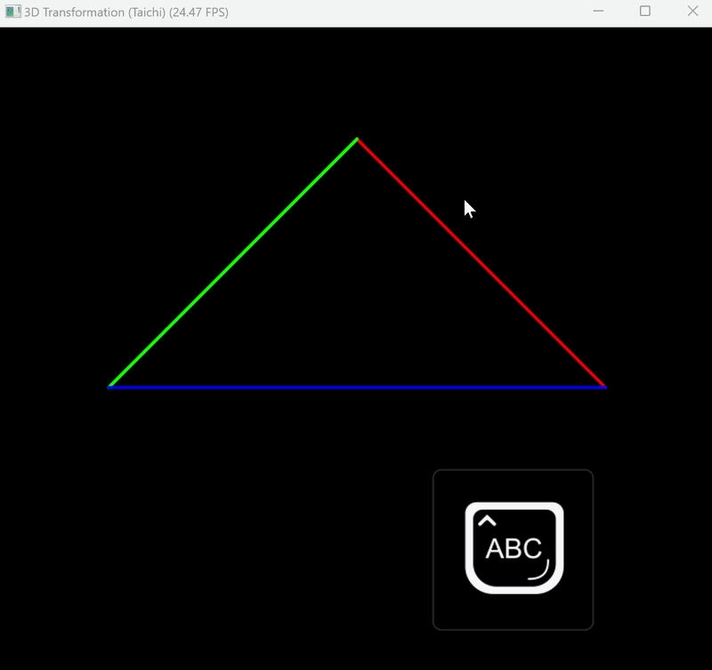

# Taichi 3D 三角形变换演示

这是一个使用 **Taichi** 语言实现的简单 3D 图形渲染管线演示。它展示了如何通过 MVP（模型-视图-投影）变换将一个 3D 三角形投影到 2D 屏幕上，并支持键盘交互旋转。


##  功能特性

- **完整的 3D 变换流程**：模型矩阵、视图矩阵、透视投影矩阵的完整实现
- **实时交互**：使用 `A` / `D` 键控制三角形绕 Z 轴旋转
- **可视化**：在 Taichi GUI 中绘制三角形的三条边（RGB 三色）
- **教学友好**：代码结构清晰，适合学习图形学基础概念

##  快速开始

### 环境要求

- Python 3.7+
- Taichi 最新版本

### 安装依赖

```bash
pip install taichi
